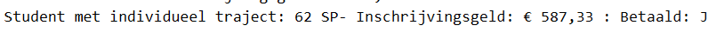
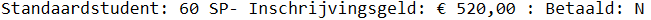
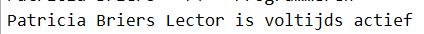
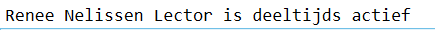

# KlasseOverervingPersoon

Maak een toepassing om de gegevens van *studenten*, *lectoren* of je
eigen *persoonlijke* *gegevens* op te vragen. We werken zoveel mogelijk
met klassen.

***Leeg venster***

***Venster actief bij knop Student***

***Venster actief bij knop Lector***

De toepassing maakt gebruik van een bestanden *studenten.csv* en
*lectoren.csv* waarin de studentengegevens en de gegevens van de
lectoren zijn opgenomen.

Hieronder zie je een stuk van **studenten.csv** waarin je de volgende
kolommen zie:

-   Naam

-   Voornaam

-   Straat

-   Postcode

-   Betaald: J of N

-   Afdelingscode: SNE, PRO, DVG en IOT. De codes bevatten
    achtereenvolgens de afdelingen: Systemen en netwerken, Programmeren,
    Digitale vormgeving en Internet of things.

-   TypeStudent: G of I waarbij G een gewone student is die een normaal
    traject volgt en I een student is met een individueel traject.

-   Studiepunten die enkel voor studenten met een individueel traject
    voorkomen.

Het bestand lectoren.csv bevat de volgende kolommen:

-   Naam

-   Voornaam

-   Geboortedatum

-   Straat

-   Postcode

-   Statuut: DT of FT (deeltijds of fulltime)

-   Afdelingscode: SNE, PRO, DVG en IOT. De codes bevatten
    achtereenvolgens de afdelingen: Systemen en netwerken, Programmeren,
    Digitale vormgeving en Internet of things.

-   Indienst: startdatum dat de lector begonnen is.

We vertrekken vanuit de klasse PERSOON. De klassen LECTOR en STUDENT
erven de basiseigenschappen en methods over. Daarnaast maken we ook
gebruik van 2 statische klassen BESTANDSBEWERKING en VALIDATOR.

**Klasse Persoon**

In bovenstaande klasse diagram zie je de eigenschappen terug.

De eigenschap **Gegevens** moet overgeërfd kunnen worden en geeft de
VolledigeNaam() en geboortedatum (lange datumnotatie).

De functiemethode **VolledigNaam**() geeft voornaam en naam terug. Deze
moet men ook kunnen overerven.

De void-method **Info(string tekst)** geeft een berichtenvenster terug
met de persoonlijke gegevens.

In de lege constructor **Persoon()** kan je je persoonlijke gegevens
toekennen. Het e-mailadres wordt wel ingelezen uit het tekstvak
**TxtEmail.** Hierbij wordt gebruik gemaakt van de klasse Validator om
het tekstvak te testen.

**Klasse Validator**

Deze statische klasse bevat 2 methods om te testen of het tekstvak
TxtEmail niet leeg is/correct vooraleer je het e-mailadres doorgeeft aan
de eigenschap Email uit de klasse Persoon.

De booleaanse functiemethod **IsPresent(tekstvak)** controleert of het
tekstvak niet leeg is. Geeft *False* wanneer het tekstvak leeg is en
*True* wanneer er gegevens zijn.

De booleaanse functiemethod **IsValidEmail(tekstvak)** controleert of er
in de gegevens een '@' en '.' aanwezig. Geeft *False* wanneer het
e-mailadres foutief is en *True* wanneer het e-mailadres correct is.

**Klasse Bestandsbewerking**

Deze statische klasse bevat 2 functiemethoden die beiden een List
teruggeven.

**LeesLectoren()** leest het bestand *lectoren*.*csv* in en geeft een
List\<Lector\> terug.

**LeesStudenten()** leest het bestand *studenten*.*csv* in en geeft een
List\<Student\> terug.

**Klasse Student**

De klasse bevat bijkomende eigenschappen:

-   Startdatum: huidige dag

-   Betaald: J of N

-   TypeStudent: I of G

-   Opleiding: SNE, PRO, DVG of IOT

-   Studiepunten: moeten tussen 0 en 99 liggen

-   Inschrijvingbedrag: voor de gewone student is dit € 520 en voor de
    individuele trajecten bedraagt het 50 + (8.66667 \* studiepunten)

-   Overgeërfde eigenschap Gegevens die de eigenschap VolledigeNaam()
    uit klasse Persoon + TypeStudent + Betaald + Inschrijvingsbedrag
    geeft.

De klassen bevat eveneens een aantal methods:

-   Overgeërfde void-method **Info( string tekst)** dat onderstaande
    info teruggeeft.

> 

-   **AfdrukStartdatum():** geeft eigenschap VolledigeNaam() uit klasse
    Persoon + Startdatum

-   **AfdrukAdres():** geeft VolledigeNaam() uit klasse Persoon +
    Straat + Postcode

-   Over te erven **ToString():** Geeft TypeStudent = I onderstaande
    boodschap

> 

en bij TypeStudent = G de volgende boodschap:

> 

-   Constructor Student() dat de huidige datum aan de Startdatum
    toekent.

**Klasse Lector**

De klasse bevat bijkomende eigenschappen:

-   Statuut: DT of FT (deeltijds of fulltime)

-   Afdeling: ontvangt SNE, PRO, DVG of IOT maar geeft de volledige
    afdelingsnaam terug (Systemen en netwerken, Programmeren, Digitale
    vormgeving en Internet of things).

-   Indienst: startdatum dat de lector begonnen is.

-   Overgeërfde eigenschap Gegevens die de eigenschap VolledigeNaam()
    uit klasse Persoon + Statuut + Afdeling geeft.

De klassen bevat eveneens een aantal methods:

-   Overgeërfde void-method **Info( string tekst)** dat onderstaande
    info teruggeeft.

> 

-   **AfdrukIndienst():** geeft eigenschap VolledigeNaam() uit klasse
    Persoon + "is in dienst sinds: " + Indienst (kort datumnotatie)

-   **AfdrukAdres():** geeft VolledigeNaam() uit klasse Persoon +
    Straat + Postcode

-   Over te erven **ToString():** Geeft Statuut = FT onderstaande
    boodschap

> 

en bij Statuut = DT de volgende boodschap:

> 
